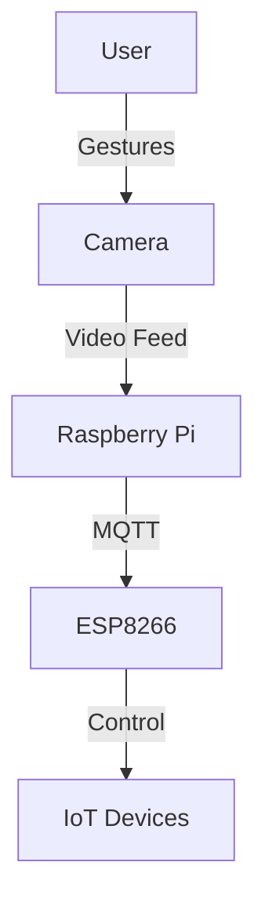
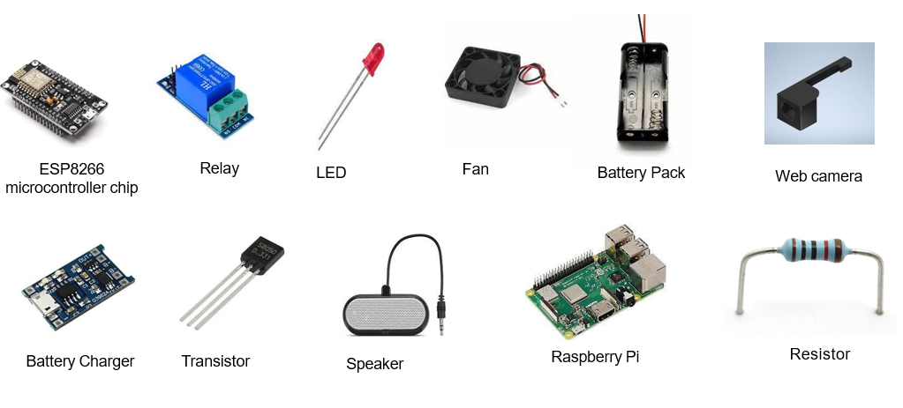
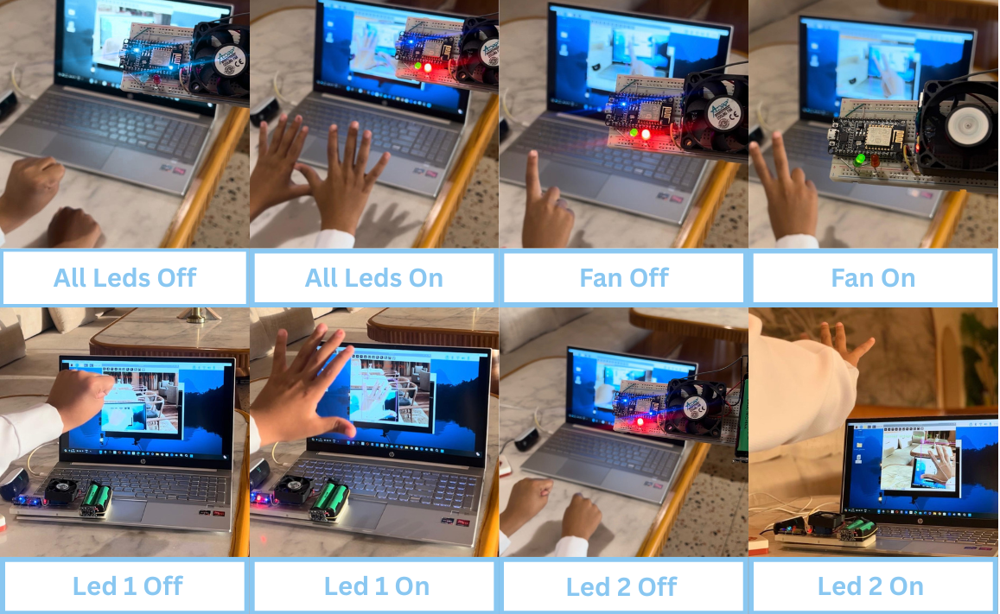

# Smart Glasses Remote Control (SGRC)

## Graduation Project
Smart Glasses Remote Control (SGRC) is a graduation project developed for the Bachelor’s degree in Computer Engineering at Taif University. 

This innovative wearable system is designed to bridge the gap between human gestures and smart environments. By utilizing Artificial Intelligence for real-time gesture recognition, the project allows users to interact with and control various IoT devices—such as lights and fans—hands-free, simply by using natural hand movements captured by the glasses.

---

## System Architecture

```mermaid
graph TD
    User[User] -->|Gestures| Camera[Camera]
    Camera -->|Video Feed| RaspberryPi[Raspberry Pi]
    RaspberryPi -->|MQTT| ESP8266[ESP8266]
    ESP8266 -->|Control| IoT_Devices[IoT Devices]
```

---

## Core Modules (src)

- hand_tracking_module.py  
- main_control.py  
- esp8266_firmware.ino  
- requirements.txt  

---

## Hardware Implementation

---

## Simulation and Testing

---
## Features

- Control devices using hand gestures  
- Real-time object recognition  
- Wireless communication via MQTT  
- Smart control of IoT devices  

## Documentation

The following materials provide complete technical and visual details about the project:

- [Final Report](./docs/Final_Report.pdf)  
- [Project Poster](./docs/Project_Poster.jpg)   

---
