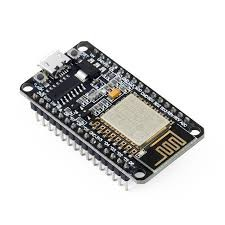
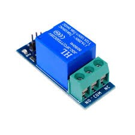
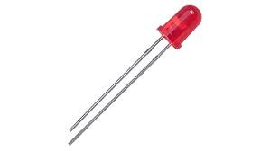
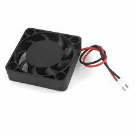
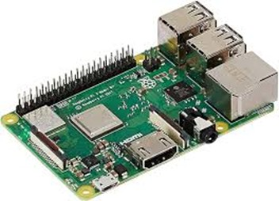
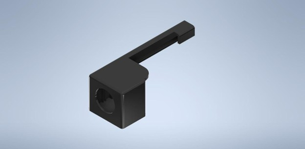

# Smart Glasses Remote Control (SGRC) 👓✨


## Overview
Smart Glasses Remote Control (SGRC) is an innovative wearable system that allows users to control IoT devices using hand and head gestures captured by smart glasses. Utilizing AI technologies like gesture recognition and object detection, the system enables touch-free interaction with smart home appliances.

> **Built with:** Python, MediaPipe, OpenCV, Raspberry Pi, ESP8266 (NodeMCU), MQTT

---

## 📁 Repository Structure
Based on the project architecture, the files are organized as follows:
* **`/Diagram`**: Engineering schematics, block diagrams, and system concept designs.
* **`/Hand Gesture Control`**: Real-time testing results showing the system controlling various devices.
* **`/Hardware 3D`**: STL files for 3D printing (Gears, Brackets, and Sensor mounts).
* **`/Simulation`**: Proteus project files and required libraries for virtual testing.
* **`/Software`**: Source code including Python scripts for Raspberry Pi and C++ for NodeMCU.

---

## 📐 System Architecture
```mermaid
graph TD
    User[👤 User] -->|🖐️ Gestures| Camera[📷 Camera]
    Camera -->|🎥 Video Feed| RaspberryPi[🍓 Raspberry Pi]
    RaspberryPi -->|📡 MQTT| ESP8266[📶 ESP8266]
    ESP8266 -->|🔌 Control| IoT_Devices[🏠 IoT Devices]
🧩 Hardware Components
<table>
<tr>
<th>Image</th>
<th>Component</th>
<th>Description</th>
</tr>
<tr>
<td align="center"></td>
<td><strong>NodeMCU V3</strong></td>
<td>ESP8266 microcontroller for wireless IoT control.</td>
</tr>
<tr>
<td align="center"></td>
<td><strong>Relay</strong></td>
<td>Electronic switch for high-voltage devices like fans.</td>
</tr>
<tr>
<td align="center"></td>
<td><strong>LED</strong></td>
<td>Visual indicator for system feedback and status.</td>
</tr>
<tr>
<td align="center"></td>
<td><strong>Mini Fan</strong></td>
<td>5V DC fan controlled via gesture commands.</td>
</tr>
<tr>
<td align="center"></td>
<td><strong>Raspberry Pi</strong></td>
<td>Central processing unit for AI and gesture recognition.</td>
</tr>
<tr>
<td align="center"></td>
<td><strong>Web Camera</strong></td>
<td>Captures real-time frames for MediaPipe landmark processing.</td>
</tr>
</table>
