# Smart Glasses Remote Control (SGRC)


## Overview
Smart Glasses Remote Control (SGRC) is an innovative wearable system that allows users to control IoT devices using hand and head gestures captured by smart glasses. Utilizing AI technologies like gesture recognition and object detection, the system enables touch-free interaction with smart home appliances.

> **Built with:** Python, MediaPipe, OpenCV, Raspberry Pi, ESP8266 (NodeMCU), MQTT

---

## Features
- Hand gesture-based control of lights, fans, and appliances
- Object detection and environmental awareness
- Wireless communication between devices (MQTT protocol)
- Designed for ease of use, accessibility, and real-time response
- Suitable for smart homes, healthcare environments, and more

---

## System Architecture
- **Client:** Runs on smart glasses (captures hand/head movements)
- **Server:** Runs on a remote Raspberry Pi (processes and interprets signals)
- **IoT Layer:** Communicates with devices (lights, fans, etc.) via ESP8266

```mermaid
graph TD
    User[👤 User] -->|🖐️ Gestures| Camera[📷 Camera]
    Camera -->|🎥 Video Feed| RaspberryPi[🍓 Raspberry Pi]
    RaspberryPi -->|📡 MQTT| ESP8266[📶 ESP8266]
    ESP8266 -->|🔌 Control| IoT_Devices[🏠 IoT Devices]
```




## Installation and Usage

### Requirements
- Python 3.x
- Raspberry Pi 4B
- ESP8266 NodeMCU
- Proteus (for simulation)
- MediaPipe, OpenCV, TensorFlow Lite

### Setup Instructions
1. Clone this repository:
```bash
git clone https://github.com/your-username/smart-glasses-remote-control.git
```

2. Install the required Python packages:
```bash
pip install -r requirements.txt
```

3. Flash the ESP8266 with the provided firmware and configure Wi-Fi and MQTT settings.

4. Connect the Raspberry Pi with the camera and load the Python scripts.

5. Run the server:
```bash
python server.py
```

6. Wear the smart glasses, perform the predefined hand gestures, and start controlling your smart devices!

---

## Hardware List
| Component | Description | Approximate Cost (SAR) |
|-----------|-------------|-------------------------|
| Raspberry Pi 4B | Main processing unit | 470 |
| ESP8266 NodeMCU | IoT controller | 50 |
| Web Camera | Captures hand movements | 350 |
| Relay Module | Control high-voltage devices | 20 |
| LEDs | Indicator lights | 5 |
| 5V Fan | Ventilation control | 40 |
| Battery Pack | Power source | 10 |
| 3D Printed Case | Protection for hardware | 90 |
| Jumper Wires | Circuit connections | 5 |

---

## Media Section
**Screenshots and Diagrams:**

> ✨ **Add your screenshots here by uploading to GitHub and inserting the links below:**

- 
- 
- 

---

## Future Improvements
- Integrate voice commands alongside hand gestures.
- Enhance model to support more complex gestures.
- Expand compatibility with additional IoT devices.

---

## License
This project is the property of **Taif University** and is licensed for educational and research purposes only.

---

## Contributors
- Shahad Al-jouid
- Sara Al-boqami
- Hala Al-dhais
- Razan Hamdan Al-sawat
- Rawan al-zahrani
- Rahaf Al-osimi
- Khawlah Al-dosari
- Ohoud al-otaibi
- Shayma Ahmed Al-kabi

Supervisor: Dr. Sameer Alsharif

---

## Acknowledgment
Special thanks to **Taif University** for the continued support and guidance throughout this project.

---

> "Making smart living even smarter ✨ — SGRC Team"

---


<!-- Feel free to adjust "path-to-your-image.png" with the correct GitHub image links after upload -->
