# Smart Glasses Remote Control (SGRC)

## Overview
Smart Glasses Remote Control (SGRC) is an innovative wearable system that allows users to control IoT devices using hand and head gestures captured by smart glasses. Utilizing AI technologies like gesture recognition and object detection, the system enables touch-free interaction with smart home appliances.

> **Built with:** Python, MediaPipe, OpenCV, Raspberry Pi, ESP8266 (NodeMCU), MQTT

---

## Features
- Hand gesture-based control of lights, fans, and appliances
- Object detection and environmental awareness
- Wireless communication between devices (MQTT protocol)
- Designed for ease of use, accessibility, and real-time response
- Suitable for smart homes, healthcare environments, and more

---

## System Architecture
- **Client:** Runs on smart glasses (captures hand/head movements)
- **Server:** Runs on a remote Raspberry Pi (processes and interprets signals)
- **IoT Layer:** Communicates with devices (lights, fans, etc.) via ESP8266

```mermaid
graph TD
    User[👤 User] -->|🖐️ Gestures| Camera[📷 Camera]
    Camera -->|🎥 Video Feed| RaspberryPi[🍓 Raspberry Pi]
    RaspberryPi -->|📡 MQTT| ESP8266[📶 ESP8266]
    ESP8266 -->|🔌 Control| IoT_Devices[🏠 IoT Devices]
```

## Installation and Usage

### Requirements
- Python 3.x
- Raspberry Pi 4B
- ESP8266 NodeMCU
- Proteus (for simulation)
- MediaPipe, OpenCV, TensorFlow Lite

---

## 🧩 Hardware Components

<table>
  <tr>
    <th>Image</th>
    <th>Component</th>
    <th>Description</th>
  </tr>
  <tr>
    <td align="center"></td>
    <td><strong>NodeMCU V3</strong></td>
    <td>A Wi-Fi-enabled microcontroller (ESP8266) used to control smart devices wirelessly.</td>
  </tr>
  <tr>
    <td align="center"></td>
    <td><strong>Relay</strong></td>
    <td>An electronically operated switch that enables devices like fans to be controlled via NodeMCU signals.</td>
  </tr>
  <tr>
    <td align="center"></td>
    <td><strong>LED</strong></td>
    <td>A light-emitting diode used as a visual indicator for system states or alerts.</td>
  </tr>
  <tr>
    <td align="center"></td>
    <td><strong>Mini Fan</strong></td>
    <td>A compact 5V fan used for simple ventilation or as a demonstration of smart home appliances.</td>
  </tr>
  <tr>
    <td align="center"></td>
    <td><strong>Transistor</strong></td>
    <td>Acts as an electronic switch to control the voltage required to operate the relay from NodeMCU.</td>
  </tr>
  <tr>
    <td align="center"></td>
    <td><strong>Battery Pack</strong></td>
    <td>Holds 2xAA batteries to provide around 3V to power the circuit.</td>
  </tr>
  <tr>
    <td align="center"></td>
    <td><strong>Battery Charger</strong></td>
    <td>A TP4056-based charging circuit used to safely recharge and protect Li-ion batteries.</td>
  </tr>
  <tr>
    <td align="center"></td>
    <td><strong>Speaker</strong></td>
    <td>A small speaker that delivers audible warnings or sound feedback when commands are triggered.</td>
  </tr>
  <tr>
    <td align="center"></td>
    <td><strong>Raspberry Pi</strong></td>
    <td>A mini computer used for processing and interfacing the camera with the smart system.</td>
  </tr>
  <tr>
    <td align="center"></td>
    <td><strong>Web Camera</strong></td>
    <td>A digital camera that captures hand gestures and feeds them to recognition algorithms like MediaPipe.</td>
  </tr>
</table>

---

## Media 

  <h3>Proposal Design Modules</h3>
  

  <h3>Proposed System Block Diagram</h3>
  

  <h3>System Concept Description</h3>
  

---

## Future Improvements
- Integrate voice commands alongside hand gestures.
- Enhance model to support more complex gestures.
- Expand compatibility with additional IoT devices.

---

## License
This project is the property of **Taif University** and is licensed for educational and research purposes only.

---

## Contributors
- Shahad Al-jouid
- Sara Al-boqami
- Hala Al-dhais
- Razan Hamdan Al-sawat
- Rawan al-zahrani
- Rahaf Al-osimi
- Khawlah Al-dosari
- Ohoud al-otaibi
- Shayma Ahmed Al-kabi

Supervisor: Dr. Sameer Alsharif

---

## Acknowledgment
Special thanks to **Taif University** for the continued support and guidance throughout this project.

---

> "Making smart living even smarter ✨ — SGRC Team"

---

<!-- Feel free to adjust "path-to-your-image.png" with the correct GitHub image links after upload -->
