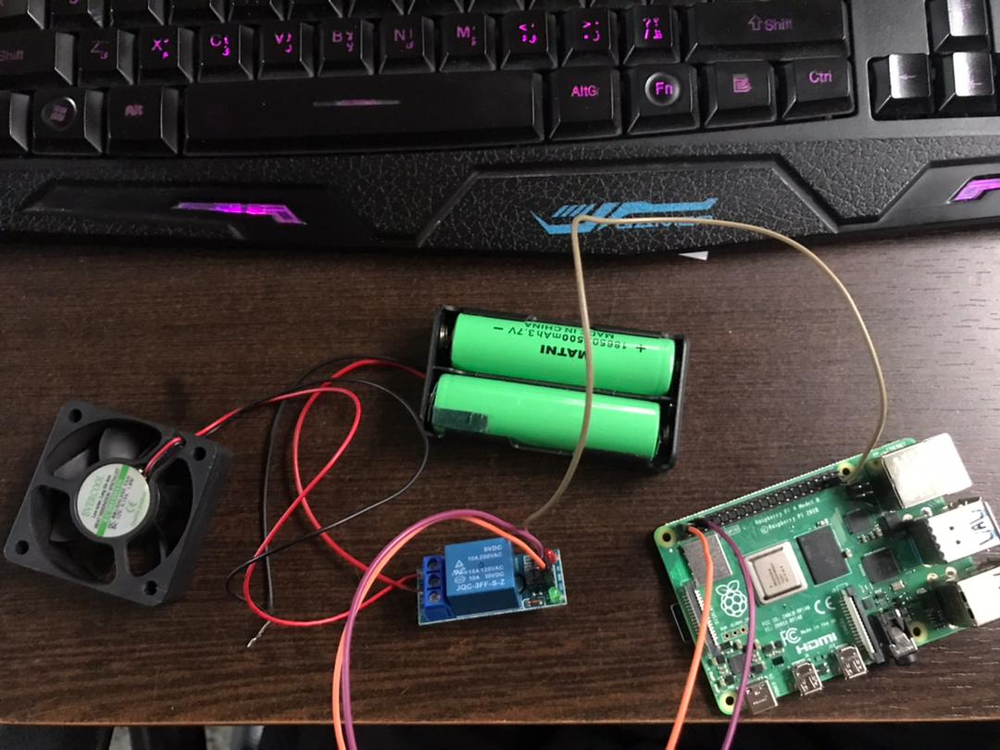
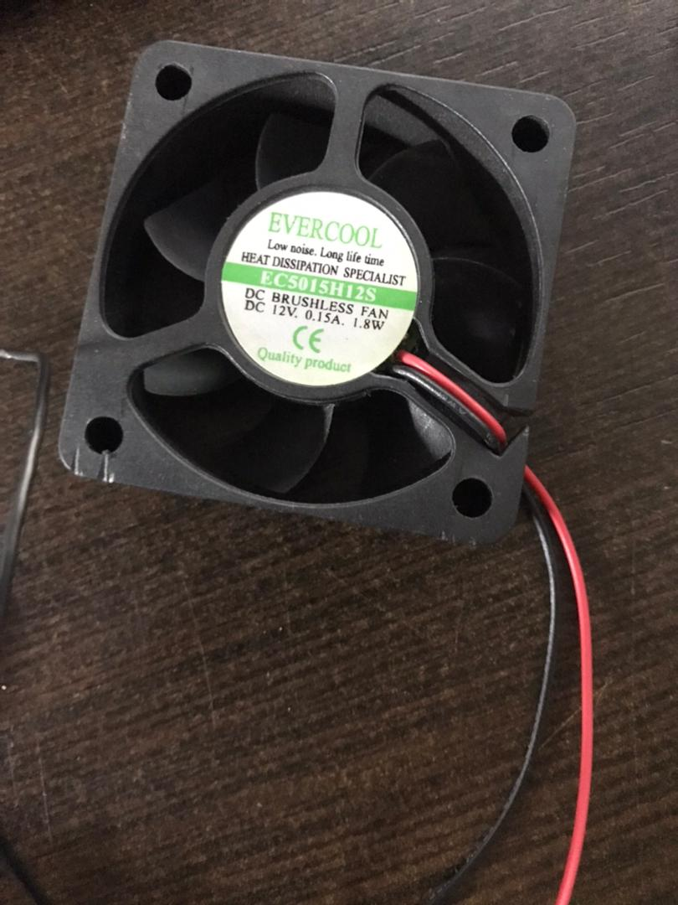
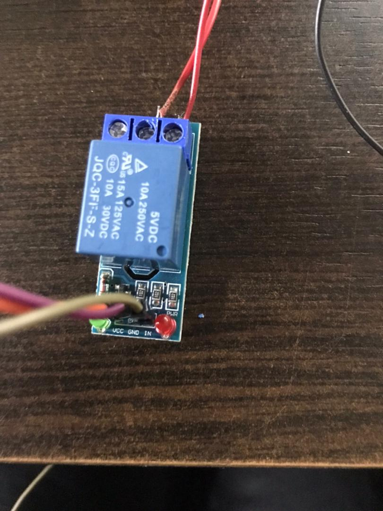
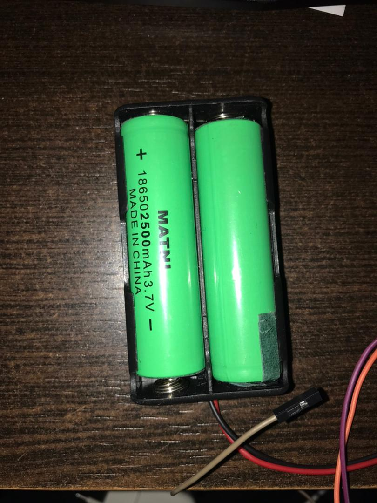

## Sprint 4–5: Object Segmentation and Obstacle Warning
🗓 Date: [2024/02/27]
---

🌟 Goal: Implement face recognition, obstacle detection, and an audible warning system.

✅ Completed Tasks
Integrated face_recognition or MobileNet for face detection.

Applied image segmentation techniques to detect obstacles.

Enabled audible warning system when obstacles are detected nearby.

📷 Images
<h3 style="text-align:center;">Smart Glasses Remote Control System – Image Descriptions</h3>

<table>
  <tr>
    <td align="center">
       
      The user wears smart glasses capturing hand gestures via the built-in camera.
    </td>
    <td align="center">
       
      Specific hand gesture is performed to trigger a smart device action, like turning on a light.
    </td>
  </tr>
  <tr>
    <td align="center">
       
      Raspberry Pi processes the received gesture data and converts it into control commands.
    </td>
    <td align="center">
       
      The system activates a smart device (e.g., LED or fan) in response to the detected gesture.
    </td>
  </tr>
</table>

📈 Next Sprint
Sprint 6 – Performance optimization and testing

